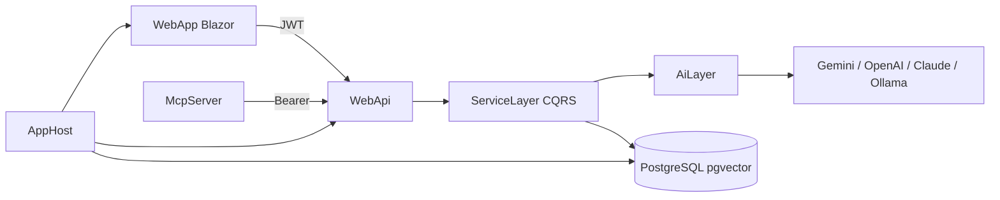

# Task Manager — .NET AI Demo

A full-stack **task manager** used to demonstrate practical **AI engineering with .NET**: LLM integrations, embeddings/RAG, agents, and MCP — on top of a clean Blazor + ASP.NET Core architecture.

> Demo / portfolio project, not a production SaaS product.

## What this showcases

| Area | Implementation |
|------|----------------|
| Summarization | Short AI summaries of task descriptions |
| Classification | Priority suggestions (guardrails + confidence) |
| Embeddings | Local **ONNX** `bge-small-en-v1.5` (384-d) → **pgvector** |
| Semantic search | Similarity search over todo embeddings |
| RAG | Natural-language Q&A over the user’s tasks |
| Function calling | Tool-style AI actions against the API |
| Agents | **Microsoft Agent Framework** Analyst → Planner sprint workflow |
| MCP | Standalone MCP server for Claude Desktop |
| Multi-provider LLMs | Google Gemini, OpenAI, Azure OpenAI, Claude, Ollama |

UI: MudBlazor Blazor WASM (todos, sprints, AI Chat). Orchestration: **.NET Aspire** (Postgres + WebApi + WebApp).

## Architecture

```
src/
├── WebApp/           # Blazor WASM (MudBlazor, Auth0, Rx state)
├── WebApi/           # ASP.NET Core API (JWT, Swagger, SignalR)
├── AiLayer/          # Pipelines: summarize, classify, embed, RAG, SK tools
├── ServiceLayer/     # CQRS handlers (MediatR), agents, queues
├── DataLayer/        # EF Core + PostgreSQL / pgvector
├── Core/             # Domain, abstractions
├── ViewModel/        # Commands, DTOs, FluentValidation
├── McpServer/        # MCP stdio server → WebApi
├── AppHost/          # .NET Aspire orchestrator
└── ServiceDefaults/  # Health, OTel, resilience
```



**Stack highlights:** .NET 10, CQRS + MediatR, Auth0, EF Core, Semantic Kernel / Microsoft Agent Framework, Aspire.

## Quick start

**Prerequisites:** .NET 10 SDK, Docker (for Postgres via Aspire), Auth0 app configured, an LLM API key.

```bash
# 1) AI key (WebApi user secrets)
cd src/WebApi
dotnet user-secrets set "Ai:GoogleAI:ApiKey" "your-key"

# 2) Local embedding model (once)
./scripts/download-bge-onnx.sh

# 3) Run everything
dotnet run --project src/AppHost/AppHost.csproj
```

| App | URL |
|-----|-----|
| WebApp | https://localhost:5002 |
| WebApi / Swagger | https://localhost:5001/swagger (or http://localhost:5000) |
| Aspire dashboard | opened by AppHost |
| pgAdmin (optional) | http://localhost:5050 |

Without Aspire: `docker compose up -d` (Postgres on **5433**), set `ConnectionStrings:MainDb` in WebApi user secrets, then run WebApi + WebApp separately.

## AI features (in the UI)

- **Todos** — create/edit tasks; AI summary + priority classification; semantic search toggle  
- **AI Chat** — Ask (RAG), Tools (function calling), Optimize Sprint (multi-agent)  
- **Sprints** — list/detail of agent-created sprint plans  

Feature flags live under `Ai:Features` in [`src/WebApi/appsettings.json`](src/WebApi/appsettings.json) (`EnableSummarization`, `EnableEmbeddings`, `EnableRag`, `EnableAgents`, …).

## MCP (Claude Desktop)

Standalone process in `src/McpServer` (stdio). Tools: `create_todo`, `update_todo`, `search_todos`, `analyze_workload`.  
Setup: [`docs/mcp/README.md`](docs/mcp/README.md).

## Configuration notes

- Secrets via **user-secrets** / env vars — never commit keys.  
- Aspire injects `ConnectionStrings__MainDb`; don’t run Compose Postgres and Aspire Postgres together unless intentional.  
- Prefer `Ai:Agents:ChatModel` = `gemini-2.5-flash` (or OpenAI) for tool-calling agents.  
- More Aspire detail: [`docs/aspire/README.md`](docs/aspire/README.md).

## License

Demo / learning project. Use and adapt as needed for interviews, workshops, and portfolio demos.
